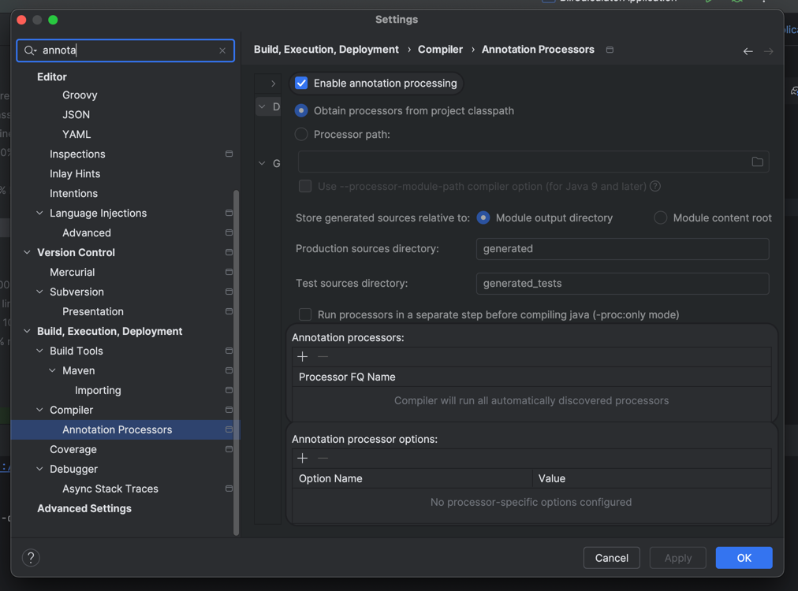
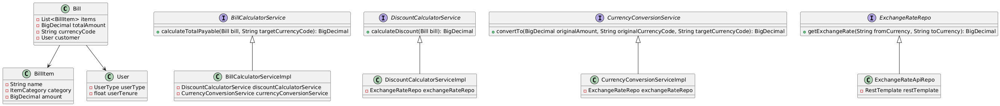

# Bill Calculator

This is a Spring Boot application that integrates with a third-party currency
exchange API to retrieve real-time exchange rates. The application calculates the total
payable amount for a bill in a specified currency after applying applicable discounts. The
application exposes an API endpoint that allows users to submit a bill in one currency
and get the payable amount in another currency.

## Table of Contents

- [Prerequisites](#prerequisites)
- [Setup and Installation](#setup-and-installation)
- [REST API](#rest-api)
- [Project Structure](#project-structure)

## Prerequisites

Make sure you have the following softwares are installed:

- **Java 17 or higher**
- **Git** (if cloning the project)

To check if Java is installed, run:

```bash
java -version
```
- **ExchangeRateAPI Key is obtained** ([check here](https://www.exchangerate-api.com/docs/authentication))

## Setup and Installation

Follow these steps to set up and install the project locally:

1. **Clone the repository:**
   Open a bash terminal and run following
   ```bash
   git clone https://github.com/byapa/bill_calculator.git
   ```
2. **Navigate to the project directory:**
   ```bash
   cd bill_calculator
   ```
3. Set the Exchange Rate API key as an environment variable
   ```bash
   export EXCHANGERATE_API_KEY=TEST_API_KEY
   ```
4. **Build to install dependencies and set up the project:**
   ```bash
   ./gradlew build
   ```
   This will download and install all the necessary dependencies as defined in the `build.gradle` file.
5. **Run all tests**
   ```bash
   ./gradlew test
   ```
6. **Run all tests and generate code coverage report**

   This project uses JaCoCo to measure code coverage.
   ```bash
   ./gradlew test jacocoTestReport
   ```
   After running the above command, you can find the coverage report in: `build/reports/jacoco/test/html/index.html`. Open the HTML report in your browser to view detailed coverage information.
7. **Run the application**
   ```bash
   ./gradlew bootRun
   ```
   By default, the application will be available at http://localhost:8080
   
   To run on a custom port pass the `server.port` argument:
   ```bash
   ./gradlew bootRun --args='--server.port=8081'
   ```
8. This project uses Lombok therefore, in your IDE please enable Annotation Processing
   

## REST API

Swagger Doc: /swagger-ui/index.html

## Project Structure
### Class Diagram

source: [diagram.puml](wiki/class_diagram/diagram.puml)

